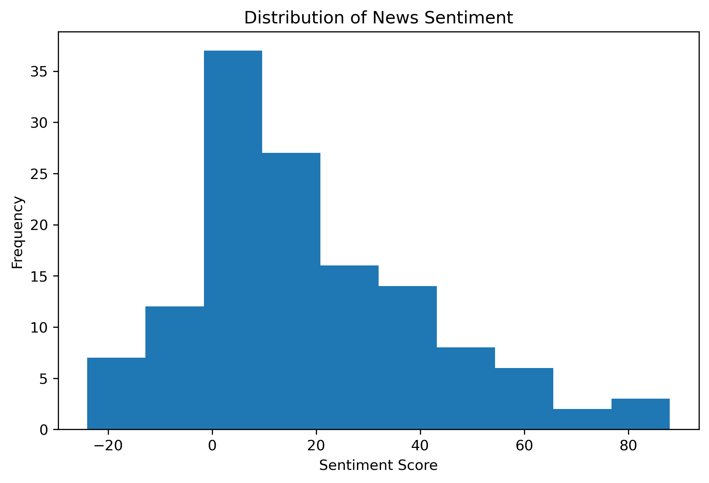
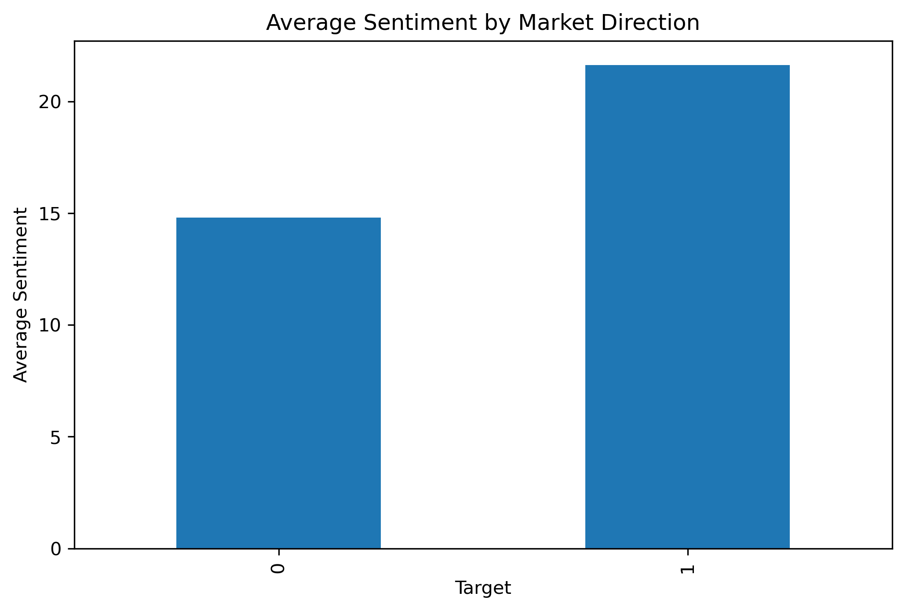
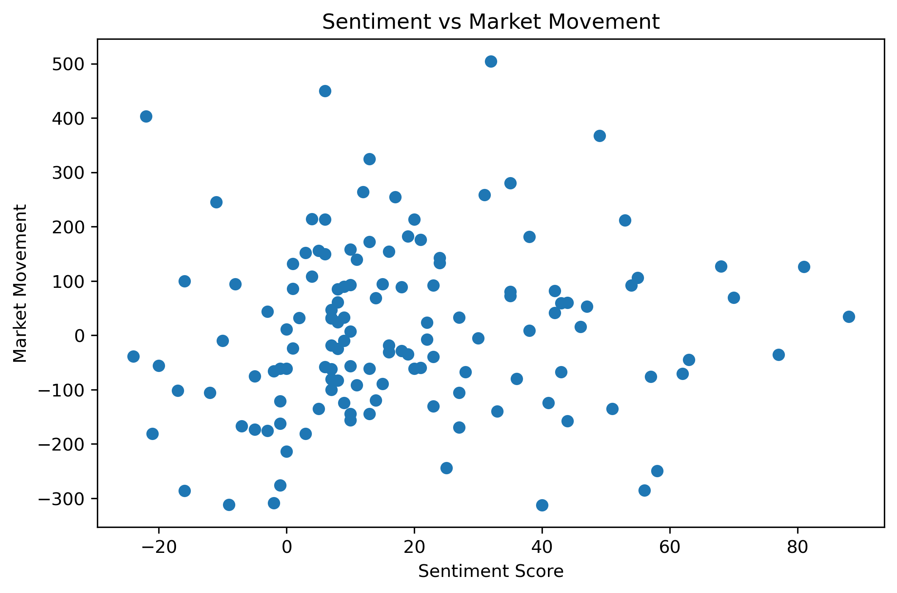
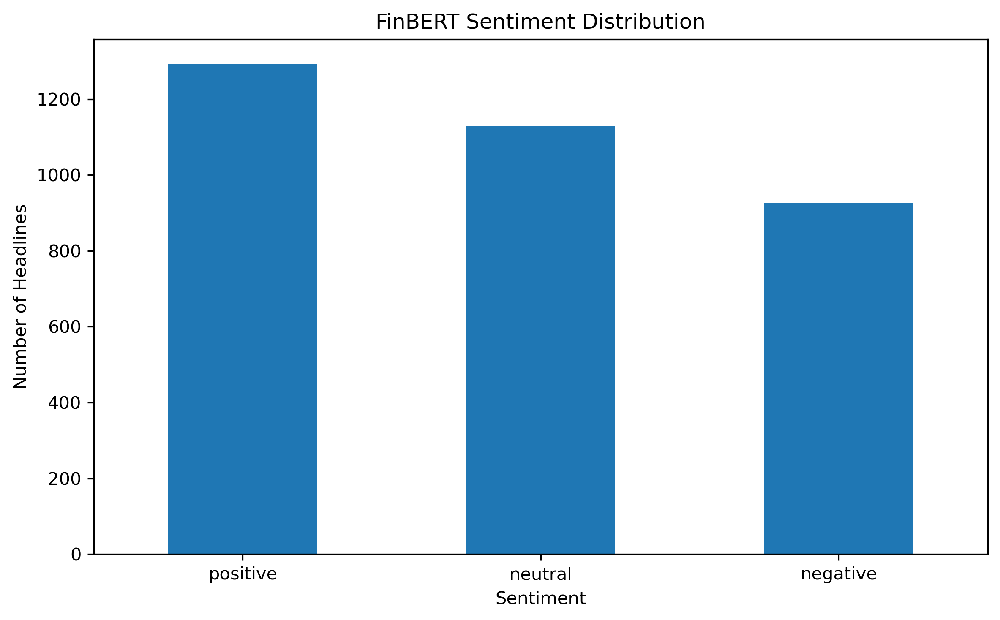
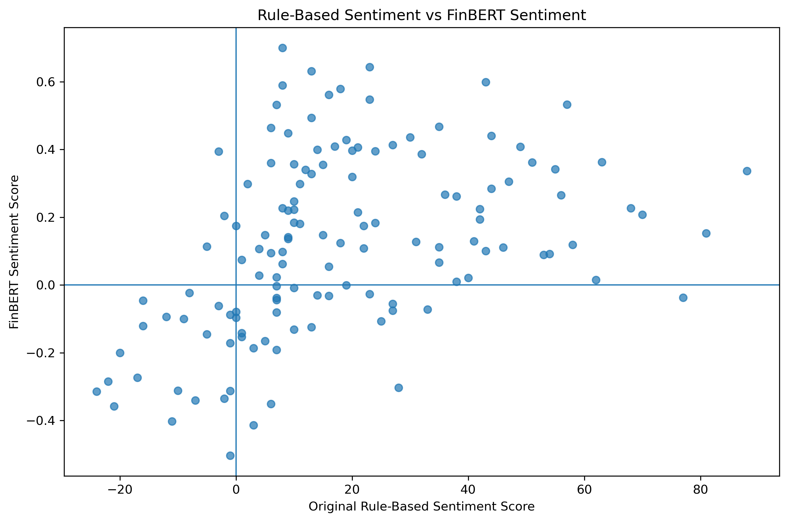
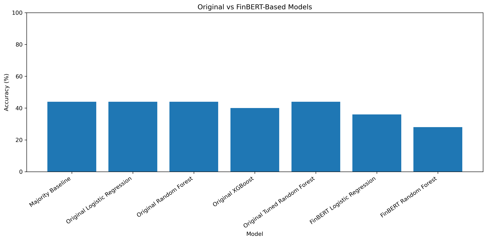
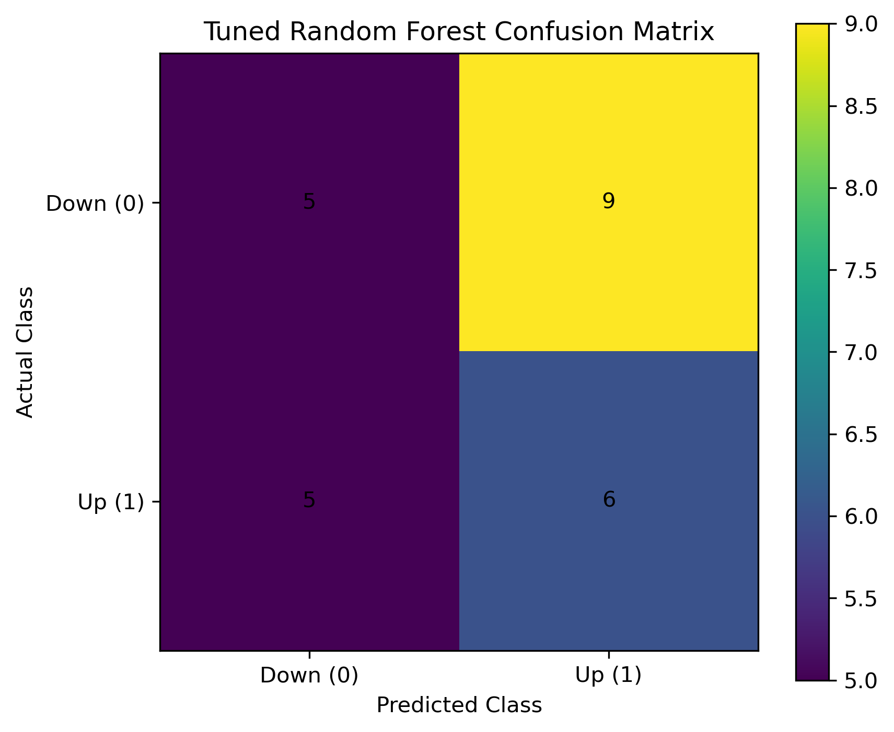
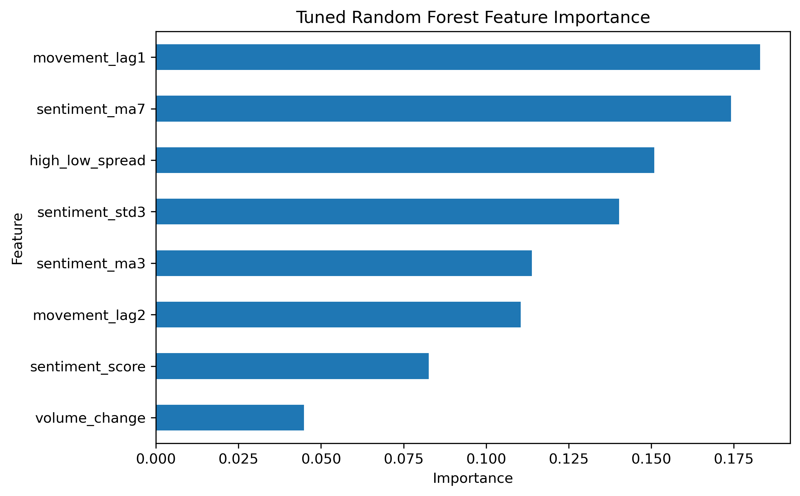
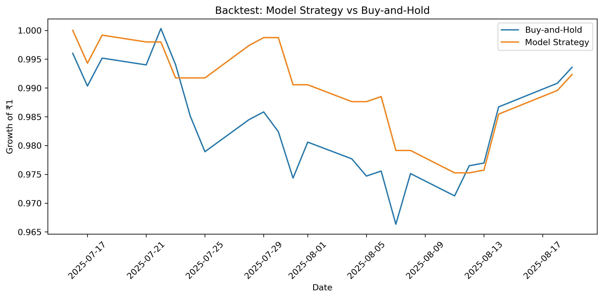

# Financial-News-Sentiment-Analysis---KElective-Assignment


An academic machine learning and NLP project exploring whether **financial news sentiment can help predict the next-day direction of the NIFTY 50 stock market**.

The project compares a traditional **rule-based sentiment analysis approach** with **FinBERT**, a transformer-based model designed for financial text, and then uses machine learning models to predict whether the market will move **UP or DOWN** on the following trading day.

> **Academic Project:** Developed as part of a university elective course.
>  **Disclaimer:** This project is for educational and experimental purposes only and is **not financial advice**.

---

##  Overview

The core idea behind the project is:

```text
Financial News Headlines
          │
          ▼
   Sentiment Analysis
     ┌────┴────┐
     ▼         ▼
Rule-Based   FinBERT
Sentiment    Sentiment
     │         │
     └────┬────┘
          ▼
  Feature Engineering
          │
          ▼
 Machine Learning Models
          │
          ▼
Next-Day Market Direction
       UP / DOWN
```

The project investigates whether information contained in financial news headlines has a measurable relationship with subsequent market movements.

---

# Objectives

* Clean and preprocess financial news and NIFTY 50 market datasets.
* Combine news headlines with market data using dates.
* Develop a rule-based financial sentiment scoring system.
* Apply **FinBERT** for domain-specific financial sentiment analysis.
* Engineer sentiment and market-based features.
* Predict the **next-day market direction**.
* Compare multiple machine learning algorithms.
* Tune a Random Forest model using time-series cross-validation.
* Compare rule-based sentiment with FinBERT.
* Perform a basic backtest against a buy-and-hold strategy.

---

# Technologies Used

| Category         | Technologies                                |
| ---------------- | ------------------------------------------- |
| Language         | Python                                      |
| Data Processing  | Pandas, NumPy                               |
| Visualization    | Matplotlib                                  |
| Machine Learning | Scikit-learn, XGBoost                       |
| NLP              | Hugging Face Transformers                   |
| Financial NLP    | FinBERT                                     |
| Models           | Logistic Regression, Random Forest, XGBoost |

---
---

#  Installation

Clone the repository:

```bash
git clone https://github.com/Arka-Deep/Financial-News-Sentiment-Analysis---KElective-Assignment.git
cd Financial-News-Sentiment-Analysis---KElective-Assignment
```

Install the required packages:

```bash
pip install -r requirements.txt
```

---

#  Requirements

The main dependencies are:

```text
pandas
numpy
matplotlib
scikit-learn
transformers
torch
xgboost
```

---

# ▶ Running the Project

The project can be run through the Jupyter Notebook.

Start Jupyter:

```bash
jupyter notebook
```

Then open:

```text
notebooks/stock_market_prediction.ipynb
```

Run the notebook sequentially from data preprocessing through model evaluation.

The FinBERT stage may take longer to execute because it requires loading a transformer model and processing the news headlines.

---

#  Project Workflow

```text
1. Load News Dataset
        ↓
2. Clean News Data
        ↓
3. Load NIFTY 50 Dataset
        ↓
4. Clean Market Data
        ↓
5. Merge News + Market Data
        ↓
6. Calculate Market Movement
        ↓
7. Rule-Based Sentiment Analysis
        ↓
8. Generate Sentiment Features
        ↓
9. Train ML Models
        ↓
10. Tune Random Forest
        ↓
11. Backtest Model
        ↓
12. Apply FinBERT
        ↓
13. Generate FinBERT Features
        ↓
14. Train FinBERT-Based Models
        ↓
15. Compare All Models
```
---
#  Dataset

The project uses two primary datasets:

### Financial News

Contains financial news headlines along with their associated dates.

The preprocessing pipeline:

* Removes unnecessary columns
* Removes missing records
* Removes duplicate records
* Cleans headline text
* Converts dates to a consistent format
* Groups headlines by date

###  NIFTY 50 Market Data

The stock dataset contains:

```text
date
open
high
low
close
shares_traded
turnover_cr
```

The two datasets are merged using their corresponding dates.

---

#  Data Preprocessing

The news dataset is cleaned before analysis, including removal of unused columns, missing values and duplicate headlines.

The market dataset is also standardized and converted to appropriate numerical and datetime formats.

The datasets are then merged on their dates to create a combined dataset containing:

```text
Market Data + News Headlines
```

---

#  Part 1 — Rule-Based Sentiment Analysis

The first approach uses a manually constructed vocabulary of financial words.

### Positive examples

```text
gain
growth
profit
rise
rally
surge
bullish
investment
earnings
dividend
partnership
approval
innovation
```

### Negative examples

```text
loss
decline
fall
drop
crash
slump
bearish
risk
inflation
recession
debt
bankruptcy
fraud
sanctions
war
```

Each headline receives a sentiment score based on the occurrence of positive and negative keywords.

```text
Positive keyword → +1
Negative keyword → -1
```

The resulting daily sentiment is then compared with actual market movement.

---

##  Sentiment Distribution



The histogram shows the distribution of the rule-based sentiment scores across the dataset.

---

##  Average Sentiment by Market Direction



This visualization compares the average sentiment score for the two market-direction classes.

---

##  Sentiment vs Market Movement



The scatter plot explores the relationship between the calculated news sentiment and the observed market movement.

---

#  Part 2 — FinBERT Sentiment Analysis

The project then extends the sentiment analysis using **FinBERT**.

FinBERT is a transformer-based language model specifically adapted for financial text.

The model classifies each headline as:

```text
Positive
Negative
Neutral
```

along with a confidence score.

The project converts these outputs into numerical sentiment scores:

```text
Positive → +confidence
Negative → -confidence
Neutral  → 0
```

Daily FinBERT sentiment is then calculated by aggregating headline-level sentiment.

---

##  FinBERT Sentiment Distribution



This plot shows the distribution of positive, negative and neutral predictions generated by FinBERT.

---

#  Rule-Based Sentiment vs FinBERT

One of the objectives of the project is to compare the manually constructed sentiment approach with a domain-specific NLP model.



The correlation between the two sentiment representations is also calculated as part of the analysis.

This provides an indication of how closely the simpler keyword-based method agrees with FinBERT.

---

#  Feature Engineering

Several features are generated for the machine learning stage.

### Sentiment Features

```text
sentiment_score
sentiment_ma3
sentiment_ma7
sentiment_std3
```

Where:

* `sentiment_ma3` → 3-day moving average
* `sentiment_ma7` → 7-day moving average
* `sentiment_std3` → 3-day sentiment standard deviation

### Market Features

```text
movement_lag1
movement_lag2
volume_change
high_low_spread
```

The target is the **next day's market direction**:

```text
1 → UP
0 → DOWN
```

---

#  Machine Learning Models

The following models are evaluated:

### 1. Majority Class Baseline

A baseline model that always predicts the most common class in the training data.

### 2. Logistic Regression

A linear classification model trained using standardized features.

### 3. Random Forest

An ensemble tree-based classifier.

### 4. XGBoost

A gradient-boosting based classification model.

### 5. Tuned Random Forest

Random Forest hyperparameters are optimized using:

```text
TimeSeriesSplit
+
GridSearchCV
```

The search considers:

```text
n_estimators
max_depth
min_samples_leaf
```

---

#  Model Comparison

The project compares the performance of the original models with the FinBERT-based models.



The comparison includes:

```text
Majority Baseline
Original Logistic Regression
Original Random Forest
Original XGBoost
Original Tuned Random Forest
FinBERT Logistic Regression
FinBERT Random Forest
```

Accuracy is calculated on the held-out test set.

---

#  Tuned Random Forest

The Random Forest model is further optimized using time-series cross-validation.

The tuned model is evaluated using:

* Accuracy
* Classification Report
* Confusion Matrix
* Feature Importance

---

##  Confusion Matrix



The confusion matrix shows the number of correctly and incorrectly classified UP/DOWN market movements.

---

##  Feature Importance



The feature-importance plot shows which engineered features contributed most to the tuned Random Forest's predictions.

---

#  Backtesting

A simple historical backtest is performed using the tuned Random Forest predictions.

Two strategies are compared:

### Buy and Hold

The investor remains invested throughout the test period.

### Model Strategy

The strategy uses the model's predicted market direction.

The cumulative growth of both approaches is calculated from the test period.



>  This is a simplified academic backtest. It does not model transaction costs, brokerage, slippage, liquidity constraints, position sizing or other real-world trading considerations.

---

#  Results Generated

The project generates several visualizations during execution:

| Visualization                         | File                                           |
| ------------------------------------- | ---------------------------------------------- |
| News Sentiment Distribution           | `plots/histogram.png`                          |
| Average Sentiment by Market Direction | `plots/barplot.png`                            |
| Sentiment vs Market Movement          | `plots/scatterplot.png`                        |
| FinBERT Sentiment Distribution        | `plots/finbert_sentiment_distribution.png`     |
| Rule-Based vs FinBERT                 | `plots/rule_based_vs_finbert.png`              |
| Tuned Random Forest Confusion Matrix  | `plots/tunedRandomForestConfusionMatrix.png`   |
| Backtest                              | `plots/backtest.png`                           |
| Original vs FinBERT Models            | `plots/original_vs_finbert_models.png`         |
| Random Forest Feature Importance      | `plots/tunedRandomForestFeatureImportance.png` |


---

#  Limitations

This project is an academic exploration rather than a production-ready financial prediction system.

Important limitations include:

* Stock markets are affected by many factors beyond news sentiment.
* Keyword-based sentiment can miss context and sarcasm.
* Financial headlines may not fully represent the information contained in an article.
* Historical patterns may not generalize to future market conditions.
* Accuracy alone does not measure the profitability of a trading strategy.
* The backtest is simplified.
* Transaction costs and slippage are not included.
* The model predicts market direction rather than exact price movement.
* FinBERT sentiment is only one representation of financial information.

---

#  Future Improvements

Possible extensions include:

* Use complete financial articles instead of only headlines.
* Add technical indicators such as RSI, MACD and moving averages.
* Incorporate macroeconomic indicators.
* Perform stock/company-specific prediction instead of only overall market direction.
* Experiment with LSTM/GRU models.
* Experiment with transformer-based time-series models.
* Implement walk-forward validation.
* Include transaction costs and slippage in the backtest.
* Add portfolio management and position sizing.
* Develop a real-time financial news sentiment pipeline.
* Build a web dashboard to visualize market sentiment and predictions.
* Expose the prediction system through an API.

---

#  Academic Context

This project was developed as part of a **university elective course** to explore the application of:

* Natural Language Processing
* Financial sentiment analysis
* Feature engineering
* Time-series machine learning
* Classification algorithms
* Model evaluation
* Quantitative backtesting

The project provided practical experience in combining **NLP, financial datasets and machine learning** into a single analytical pipeline.

---


# Disclaimer

This project is intended **strictly for educational and research purposes**.

The predictions generated by this project should **not** be interpreted as financial advice or used as the sole basis for investment or trading decisions.
